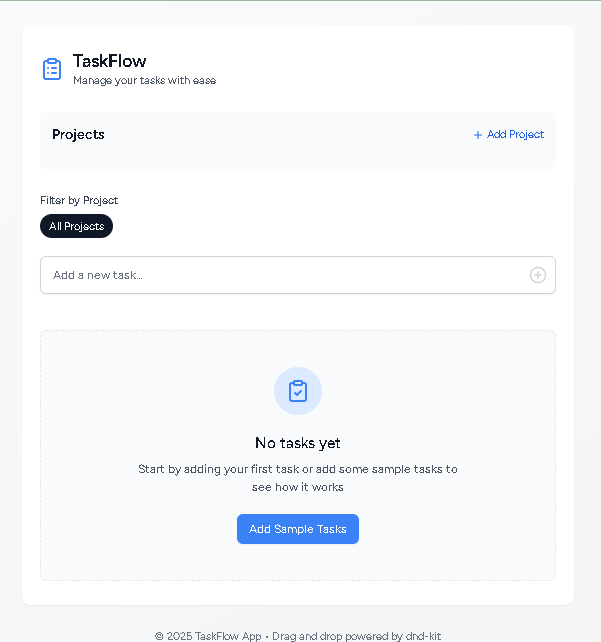

# TaskFlow - Drag & Drop Task Manager

🚀 **A sleek, interactive task management app** with project organization, priority-based sorting, and smooth drag-and-drop functionality. Built with Laravel, Inertia.js, React, and TypeScript.



## ✨ Features

### **Task Management**

- ✅ Add/edit/delete tasks with priorities
- 🖱️ Intuitive drag-and-drop reordering
- 🏷️ Organize by projects with color-coding
- 🔢 Automatic priority numbering

### **Project System**

- 🎨 Color-coded projects
- 🗂️ Filter tasks by project
- ➕ Quick project creation

### **UI/UX**

- ✨ Animated transitions with Framer Motion
- 📱 Fully responsive design
- 🎛️ Keyboard-friendly editing

## 🛠️ Tech Stack

**Frontend**

- React 18 + TypeScript
- Inertia.js
- Tailwind CSS
- Framer Motion (animations)
- dnd-kit (drag-and-drop)

**Backend**

- Laravel 12
- MySQL / SQLite

**State Management**

- Zustand

## 🚀 Installation

### Prerequisites

- PHP ≥ 8.1
- Composer
- Node.js ≥ 16
- MySQL / SQLite

### Setup Steps

1. Clone the repository:

   ```bash
   git clone https://github.com/yourusername/taskflow.git
   cd taskflow
   ```
2. Install dependencies:

   ```bash
   composer install
   npm install
   ```
3. Set up database:

   ```bash
   php artisan migrate:refresh --seed
   ```
4. Build assets:

   ```bash
   npm run build
   ```
5. Start development servers:

   ```bash
   composer run dev
   ```

## 📂 Project Structure

```
taskflow/
├── app/
│   ├── Http/Controllers/        # Laravel controllers
│   ├── Models/                  # Eloquent models
├── resources/
│   ├── js/                      # React components
│   │   ├── components/          # UI components
│   │   ├── store/               # Zustand store
│   │   ├── types/               # TypeScript types
├── routes/                      # Laravel routes
├── public/                      # Compiled assets
```

## 🧑‍💻 Development

### Common Commands

```bash
# Watch frontend changes
npm run dev
composer run dev
```

### Coding Standards

- PHP: Follow PSR-12
- JavaScript: ESLint + Prettier
- TypeScript: Strict mode enabled

## 🤝 Contributing

1. Fork the project
2. Create your feature branch (`git checkout -b feature/amazing-feature`)
3. Commit your changes (`git commit -m 'Add some amazing feature'`)
4. Push to the branch (`git push origin feature/amazing-feature`)
5. Open a Pull Request

## 📜 License

MIT License - see [LICENSE](LICENSE) for details.

---

**Enjoy task management made delightful!** ✨
For questions or support, please open an issue on GitHub.
